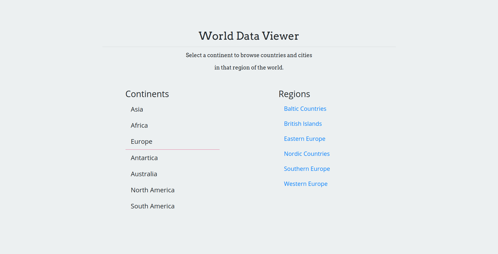

# World Data Viewer #

Simple data viewer for hierarchically displaying data from a [sample data set](#https://www.postgresql.org/ftp/projects/pgFoundry/dbsamples/world/world-1.0/ "World Dataset"). Written in React + Flask.




## Table of Contents ##
- [Overview](#overview)
- [Installation](#installation)

## Overview ##

|Software|Version|
|--------|-------|
|Client||
|[React](https://reactjs.org/docs/getting-started.html)|^16.12.0|
|[Webpack](https://webpack.js.org/concepts/)|^4.41.5|
|[Styled Components](https://styled-components.com/docs)|^5.0.1|
|Server||
|[Python](https://docs.python.org/3/)|3.8.0|
|[Flask](https://flask.palletsprojects.com/en/1.1.x/)|1.1.1|
|[SQLAlchemy](https://docs.sqlalchemy.org/en/13/)|1.3.13|

## Installation ##

Start by [downloading](https://github.com/BeautifulTovarisch/world-data-viewer/archive/dev.zip) the project.

1. Unzip the project into a directory. For example:

```bash
$ unzip world-data-viewer-dev.zip -d <target directory>
```

2. Change into the target directory and build the Docker images:

```bash
$ cd <target directory>
$ docker-compose build
```

3. Next spin up the database container:

```bash
$ docker-compose up -d database
```

> **Note:** In a true production container cluster, services would be configured to wait until their respective dependencies were online before attempting to connect. For convenience, the database service is brought up ahead of time in order to avoid the need to control startup order with scripts.

4. Finally start the rest of the cluster:

```bash
$ docker-compose up -d client server
```

The [world data viewer](http://localhost:3000) cluster should now be running and can be viewed at:

`http://localhost:3000`
